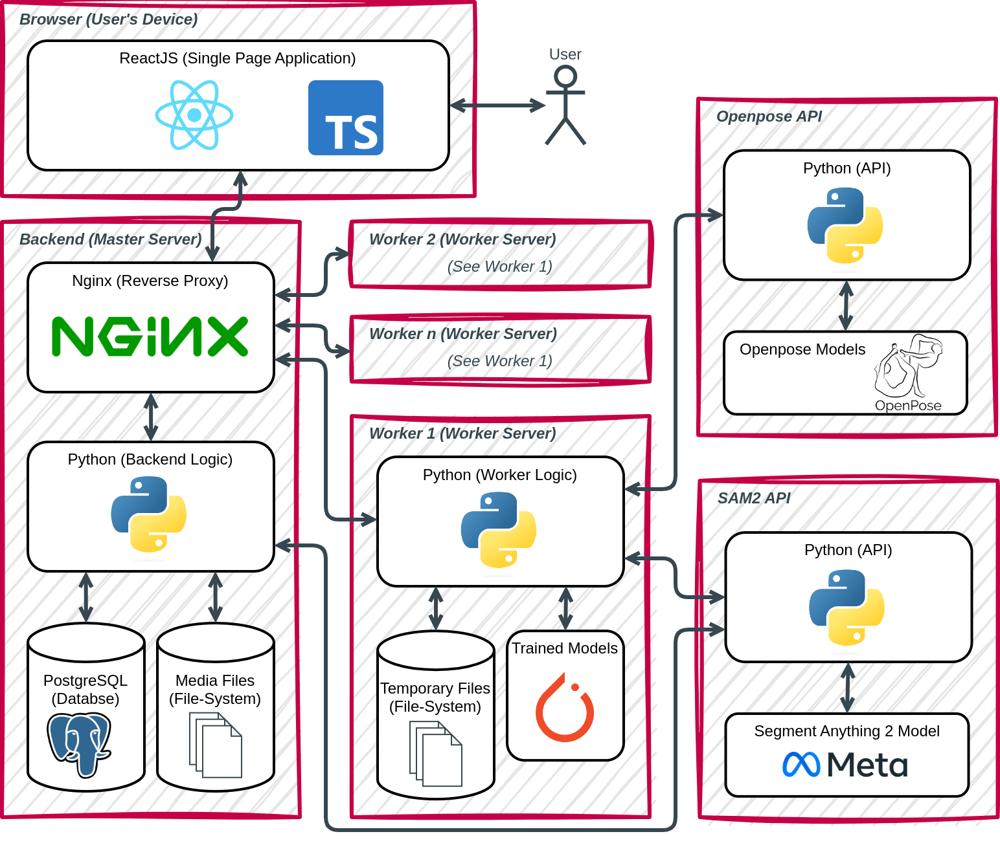
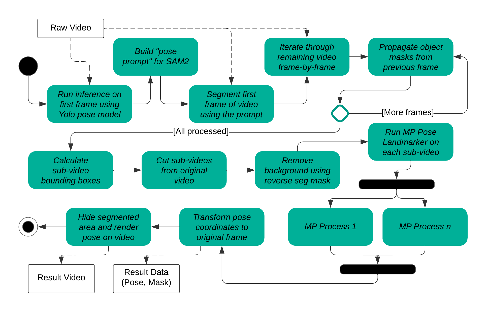

<h1 align="center">MaskAnyone - The de-identification toolbox for video data.</h1>

> The old version of MaskAnyone with various different but simpler techniques is available on the [`original`](https://github.com/MaskAnyone/MaskAnyone/tree/original) branch.

## Overview
MaskAnyone is a **de-identification toolbox for videos** that allows you to remove personal identifiable information from videos, while at the same time preserving utility. It provides a variety of algorithms that allows you to **anonymize videos** (video & audio) with just a few clicks. Anonymization algorithms can be selected and combined depending on what aspects of utility should be preserved and which computational resources are available.

MaskAnyone is a docker-packaged modern web app that is built with React, MaterialUI, FastAPI and PostgreSQL. It is designed to be easily extensible with new algorithms and to be scalable with multiple docker workers. It is also designed to be easily usable by non-technical users.

## Demo

https://github.com/user-attachments/assets/92dac144-9f15-4665-8d19-5e978d4bf4ba

Good examples that showcase what can be achieved with this approach are available here: https://drive.google.com/drive/folders/1QwlFgf-PTI46yqe8wKyC9C-YMwfF2z6o?usp=sharing. 

We have evaluated this approach against other approaches on various videos which can be found here, both as originals and masked versions: https://drive.google.com/drive/folders/1DGelFxPJhnXD_2FKoIDC76uJNvXT3ccC?usp=sharing.

## Getting Started

### Installation

> If you want to set up MaskAnyone to use and / or experiment with it, consider using the [MaskAnyoneProdInfrastructure](https://github.com/MaskAnyone/MaskAnyoneProdInfrastructure) which uses pre-built docker images for easier and optimized setup. For development purposes, continue here.

Follow these steps to install MaskAnoyone:

Make sure you have installed [Docker](https://docs.docker.com/get-docker/) on your system and set the appropriate permissions.
Note: Due to the size of CUDA images and dependencies as well as the trained models, the setup can be quite heavy. Please ensure that you have at least 30GB of free disk space available before attempting this setup.

Open a terminal on your machine.
Clone this repository by running `git clone https://github.com/MaskAnyone/MaskAnyone.git` and then switch into the cloned directory and run the following commands in this directory.
If this is the first time you are running the project, this process can take a while depending on your internet connection. If your connection times out, just run the command again.

```bash
docker compose build
docker compose run --rm yarn yarn install
docker compose up -d postgres
```
Wait a few seconds
```bash
docker compose up -d
```

### Running the Application
Once you have installed the application, you can always start up the application with 

```bash
docker compose up -d
```

The application will then be reachable under [https://localhost](https://localhost)

## For developers

In this section we have collected some further information for developers. 



### Services
- Frontend: [https://localhost](https://localhost) (Test user: `test:test`)
- Backend: [https://localhost/api/docs](https://localhost/api/docs)
- Keycloak: [https://localhost/auth/](https://localhost/auth/) (Admin user: `dev:dev`)
- PGAdmin: [https://localhost:5433/](https://localhost:5433/) (Password: `dev`)

### CLI
To run the CLI version first put the videos for masking into the folder `data/backend/videos`. Then execute the following commands:
```
docker compose -f docker-compose-cli.yml build
docker compose -f docker-compose-cli.yml run cli python3 cli.py --input-path /data/videos --output-path /data/results --hiding-strategy blurring --overlay-strategy mp_pose # example
```
Possible hiding strategies are: `solid_fill, transparent_fill, blurring, pixelation, contours, none`.

Possible overlay strategies are: `mp_hand, mp_face, mp_pose, openpose, openpose_body25b, openpose_face, openpose_body_135, none`.

The results will be stored in `/data/backend/results`. Note that you have to clear the results folder before masking again, otherwise it will not mask any video.

### Debugging
Run the application with 
```bash
docker compose up
```
to get the live output of the applicaiton and see where it might crash.
Alternatively you can use `docker compose logs -f` if you already started the application using the detached (`-d`) flag.

### Database

**Export Schema**
If you changed the schema of the DB please run the following command to refresh the schema dump.
This is to ensure that the DB schema dump is up-to-date for whenever someone sets up the project.
```bash
docker compose exec postgres pg_dump --schema-only --no-owner --username dev --create prototype > ./docker/postgres/docker-entrypoint-initdb.d/prototype.sql
```
You can also exclude the `--schema-only` parameter to include both the schema and the data in the dump.

Similarly, if you changed anything regarding the Keycloak configuration that should be included in the initial setup, please run the following command to update the Keycloak dump.
```bash
docker compose exec postgres pg_dump --username dev --create keycloak > ./docker/postgres/docker-entrypoint-initdb.d/keycloak.sql
```

**Reset DB**
To reset the DB to the latest schema simply run the following commands.
```bash
docker compose down -v
docker compose up -d postgres
```
Wait 30 seconds
```bash
docker compose up -d
```

## Process


## Status of the project
Mask Anyone was developed as a prototype showcasing different possibilities in the field of person de-identification in videos. 
While it can already produce very convincing results for a considerable subset of videos, there are still a number of issues that need to be addressed.
Please exercise caution when using this application and do not blindly rely on the results without verifying their integrity yourself.

### Credits
We thank the authors of different implementations we packaged in our project. Our project relies heavily on the work of

- Google [MediaPipe](https://github.com/google/mediapipe) for segmentation and pose estimation
- UltraLytics [YOLOv11](https://github.com/ultralytics/ultralytics) for person detection
- [Openpose](https://github.com/CMU-Perceptual-Computing-Lab/openpose) for pose estimation
- Meta [SAM2](https://github.com/facebookresearch/sam2) for video segmentation

and many more.
